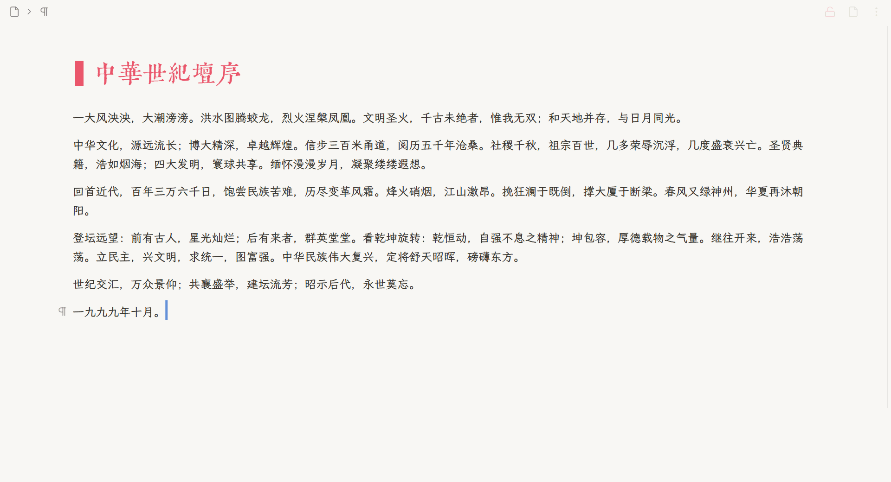

# zenType v2（禅打）

顺滑光标 + 打字机模式 + 涟漪聚焦 — 让思源笔记写作更专注。



> **⚠️ 从 v2.x（siyuan-zen）升级？**
>
> 插件已从 `siyuan-zen` 改名为 `zenType`（v2.6.1），以解决集市同步问题。SiYuan 会把新旧名字当成**两个不同的插件**，所以老用户必须：
>
> 1. **先卸载旧版 `siyuan-zen`**（设置 → 插件 → siyuan-zen → 卸载）
> 2. **再装新版的 `zenType`**（从 [Releases](../../releases) 下载新 zip）
>
> 不卸载直接装新版，列表里会同时存在两个插件。个人数据/设置不会自动迁移（需要重新开关想要的功能）。
>
> 版本历史：v1.0.6（`ZenType`）→ v2.0.0~2.6.0（`siyuan-zen`）→ v2.6.1+（`zenType`）。详见 [CHANGELOG](docs/CHANGELOG.md)。

## 功能

- **顺滑光标** — 自定义蓝色光标替换系统竖线，带平滑过渡动画
- **打字机模式** — 光标保持在屏幕 38%～50% 的舒适区间内（黄金分割偏上至中线）
- **涟漪聚焦** — 当前句最亮，周围块/句按距离渐淡（句级使用 CSS Custom Highlight API，不改内容节点结构，无数据丢失）

## 安装

1. 从 Releases 页面下载最新 zip
2. 思源笔记打开 设置 → 插件 → 从本地安装插件
3. 选择下载的 zip

## 使用

首次安装时三个模块默认均开启；后续加载会恢复已保存的各模块状态。打字机初始化会立即启用共享的打字机/涟漪状态。切换方式：

- **顶栏图标**（银河）：一键切换打字机模式 + 涟漪聚焦；两者开启时彩色星球会动起来，顺滑光标保持开启
- **命令面板**（Ctrl+Shift+P）：搜索 "zenType" 可单独切换

## 边界场景说明

### 只读模式 / 选中状态

- 只读模式下打字机自动暂停
- 拖选文字或打开悬浮窗时，涟漪聚焦自动清除；顺滑光标保持工作

### 嵌入块（视频/iframe/PDF）

- 涟漪聚焦：作为 1 个渐淡单位正常参与
- 打字机模式：跳过（嵌入块内不触发滚动）

### 嵌套块

- 涟漪只给编辑器下的顶层块设置 opacity
- 嵌套内容继承父块的 opacity，不单独递归渐淡

### 悬浮窗

- 悬浮窗里编辑时打字机自动暂停，涟漪聚焦清除

## 自定义参数（v2.6.5）

打开 `src/config.ts` 可以调节：

| 参数 | 默认值 | 说明 |
|------|--------|------|
| `CURSOR_CONFIG.HEIGHT_RATIO` | `1.05` | 光标高度 = 所在行行高 × 此倍数 |
| `CURSOR_CONFIG.BLINK_DELAY_MS` | `1100` | 停止活动后多少毫秒恢复呼吸闪烁 |
| `EDGE_FADE.ZONE` | `20` | 距编辑器可视区顶/底边缘多少像素内开始淡出（顶/底对称） |
| `TRANSITION.TIERS` | `≤30→0.07、≤150→0.15、≤500→0.21、>500→0.30` 秒 | 按移动距离分档的光标过渡时长 |

打开 `src/styles/index.scss` 可以调节颜色 / 宽度 / 关键帧；其中光标 transition 只是 CSS 兜底，正常状态的距离分档时长和曲线由 `src/modules/cursor.ts` 写入：

```scss
#zentype-cursor {
  width: 3px;                                      // 光标宽度
  background: var(--zt-cursor-color, #5d8cd7);     // 颜色（亮色主题）
  transition: transform 0.15s cubic-bezier(...);   // CSS 兜底曲线
  animation: zentype-breathe 3s 1.5s ...;          // 闪烁动画
}
```

保存后 `pnpm run dev` 会自动重新编译（思源 1-2 秒内热重载）。

### 边缘行为（v2.6.5）

光标滚出编辑器可视区（顶部或底部）时，停在最后可见位置，按 `EDGE_FADE.ZONE` 像素距离平滑淡出到 0 opacity。回到可视区时再淡入。顶/底现在完全对称。

## 路线图

完整设计见 [docs/DESIGN.md](docs/DESIGN.md)。

## 许可

MIT
